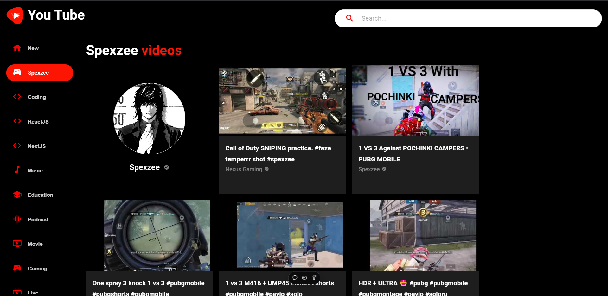

# YouTube Player

A dynamic YouTube player built with React.js, providing a smooth and engaging video-watching experience. This project integrates YouTube's API through RapidAPI, Material UI for UI components, and a custom search tool for quick access to related videos.

## Live Demo

Check out the live version of the YouTube Player here:  
[YouTube Player - Live Demo](https://spexzee-youtube.vercel.app/)

## Features

- **Seamless Video-Watching Experience**  
  The YouTube Player allows users to watch videos smoothly with enhanced controls and an intuitive interface.

- **Efficient Search Tool**  
  A custom search tool is integrated, enabling users to quickly find related videos based on a search term.

- **Simplified Related Video Discovery**  
  This feature simplifies the process of exploring related content by displaying a list of videos related to the currently playing one, offering a more engaging experience.

- **Material UI Integration**  
  The UI components of the player are styled using Material UI for a clean and modern look.

## Technologies Used

- **HTML**
- **CSS**
- **JavaScript**
- **React.js** - The core framework used for building the YouTube Player.
- **RapidAPI** - Integrated to fetch YouTube videos and related content via API calls.
- **Material UI** - For modern and responsive UI components, such as buttons, cards, and navigation bars.

## How to Run the Project Locally

1. **Clone the repository**

   ```bash
   git clone https://github.com/spexzee/Youtube.git
   ```

2. **Navigate to the project directory**

   ```bash
   cd Youtube
   ```

3. **Install dependencies**

   Make sure you have `npm` installed on your system. If not, install it from [here](https://www.npmjs.com/get-npm).

   ```bash
   npm install
   ```

4. **Run the project**

   Once all dependencies are installed, start the project locally with:

   ```bash
   npm start
   ```

   This will start the development server and open the YouTube Player app in your browser at [http://localhost:3000](http://localhost:3000).

## API Integration

The app uses **RapidAPI** to fetch video data from YouTube. You can explore the [YouTube API on RapidAPI](https://rapidapi.com/) to learn more about the API used in this project.

### Key Endpoints Used:

- **Search for videos:** Retrieves a list of videos related to a search query.
- **Fetch video details:** Provides details of a selected video, including title, description, and more.

## Screenshots

Here screenshot of the YouTube Player:



## Contribution

Feel free to fork the repository, create a branch, and submit a pull request if you'd like to contribute to the project. Make sure to add new features or fix bugs and provide relevant documentation.
